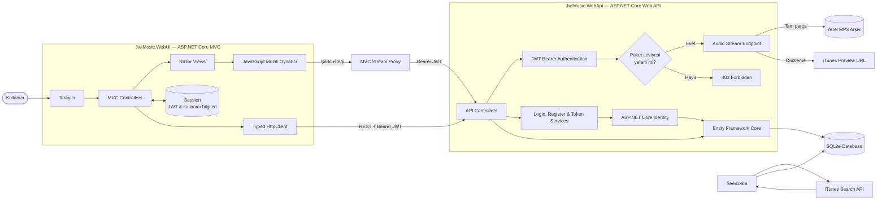

# 🎶 Reverb — JWT Tabanlı Müzik Platformu

Reverb; kullanıcıların şarkı keşfedebildiği, sanatçı ve albümleri inceleyebildiği, çalma listeleri oluşturabildiği ve üyelik seviyelerine göre müzik dinleyebildiği modern bir müzik platformudur.

Proje, birbirinden ayrılmış **ASP.NET Core Web API** ve **ASP.NET Core MVC** uygulamalarından oluşur. Kullanıcı kimliği ve üyelik bilgileri JWT claim'leriyle taşınırken katalog, dinleme geçmişi ve kişisel listeler Entity Framework Core üzerinden yönetilir.

## Öne Çıkan Özellikler

- JWT tabanlı kayıt, giriş ve yetkilendirme
- ASP.NET Core Identity ile güvenli kullanıcı yönetimi
- Basic, Gold, Premium ve Elit üyelik seviyeleri
- Üyelik seviyesine göre sunucu tarafında şarkı erişim kontrolü
- Şarkı, sanatçı, albüm ve tür bazlı katalog
- iTunes Search API üzerinden gerçek katalog bilgileri ve resmî önizlemeler
- Creative Commons lisanslı 20 tam uzunlukta parça
- HTTP range processing destekli yerel MP3 streaming
- Oynat/duraklat, önceki/sonraki, zaman çizelgesi ve ses kontrolleri
- Kullanıcıya özel çalma listeleri
- Dinleme geçmişi ve dinlenme sayacı
- Dinleme davranışı ve tür benzerliğine dayalı öneriler
- Oturum içerisinden güvenli paket yükseltme ve JWT yenileme
- Responsive, modern ve kullanıcı dostu arayüz
- Swagger ve Postman ile test edilebilir REST API

## Mimari Akış



## İstek Yaşam Döngüsü

1. Kullanıcı MVC arayüzü üzerinden giriş yapar.
2. Web UI, giriş bilgilerini Web API'ye gönderir ve imzalı JWT alır.
3. Token ve kullanıcı bilgileri güvenli sunucu oturumunda saklanır.
4. Sonraki API isteklerine `Bearer` token otomatik olarak eklenir.
5. Şarkı oynatma isteğinde API, JWT içerisindeki `PlanTier` claim'ini kontrol eder.
6. Yetkili kullanıcıya resmî önizleme URL'si veya range destekli yerel MP3 akışı sunulur.
7. Başarılı dinlemeler geçmişe kaydedilir ve dinlenme sayısı artırılır.

## Üyelik ve Yetkilendirme

| Paket | Seviye | Erişim |
|---|---:|---|
| Basic | 1 | Basic içerikler |
| Gold | 2 | Basic ve Gold içerikler |
| Premium | 3 | Basic, Gold ve Premium içerikler |
| Elit | 4 | Tüm içerikler |

Üst paketler kendilerinden düşük seviyedeki bütün içeriklere erişebilir. Yetki kontrolü yalnızca arayüzde değil, doğrudan streaming endpoint'inde uygulanır. Yetersiz paketle yapılan istekler `403 Forbidden` döndürür.

Creative Commons lisanslı 20 tam uzunluktaki parça bütün üyelik seviyelerinde dinlenebilir.

## Müzik Kataloğu

Katalog iki farklı ses kaynağını birlikte destekler:

- **64 popüler parça:** iTunes Search API üzerinden alınan sanatçı, albüm, kapak ve resmî ses önizlemeleri
- **20 tam uzunlukta parça:** Josh Woodward'ın *33⅓* ve *The Wake* albümlerinden CC BY 4.0 lisanslı MP3 kayıtları

Tam uzunluktaki kayıtlar proje içerisinde barındırılır ve ASP.NET Core `PhysicalFile` sonucu ile `enableRangeProcessing` etkin şekilde sunulur. Böylece tarayıcı parçayı tamamen indirmeden oynatabilir ve zaman çizelgesi üzerinde ileri-geri sarma yapabilir.

Her tam parçanın detay sayfasında sanatçı, kaynak sayfası ve lisans bağlantısı gösterilir. Lisans ve atıf bilgileri bu README'nin sonunda ayrıca belirtilmiştir.

## Öneri Sistemi

Parça detayındaki öneriler üç aşamalı olarak oluşturulur:

1. Aynı parçayı dinleyen kullanıcıların dinlediği diğer parçalar belirlenir.
2. Eksik kalan öneriler aynı müzik türündeki popüler parçalarla tamamlanır.
3. Son aşamada genel dinlenme sayılarına göre alternatifler eklenir.

Bu yaklaşım, dinleme geçmişi henüz oluşmamış yeni kullanıcılar için de öneri üretebilir.

## Teknolojiler

| Katman | Teknolojiler |
|---|---|
| Backend | ASP.NET Core Web API, C#, .NET 10 |
| Frontend | ASP.NET Core MVC, Razor Views, JavaScript, Bootstrap |
| Veri erişimi | Entity Framework Core, SQLite |
| Kimlik ve güvenlik | ASP.NET Core Identity, JWT Bearer, HMAC-SHA256, Anti-forgery Token |
| Entegrasyon | iTunes Search API, Typed HttpClient |
| Dokümantasyon ve test | Swagger / OpenAPI, Postman |
| Medya | HTML5 Audio, HTTP Range Processing, MP3 Streaming |

## Proje Yapısı

```text
JwtMusic/
├── JwtMusic.WebApi/
│   ├── Audio/                  # Tam uzunluktaki lisanslı MP3 dosyaları
│   ├── Context/                # DbContext ve katalog seed işlemleri
│   ├── Controllers/            # REST API endpoint'leri
│   ├── Dtos/                   # API veri transfer modelleri
│   ├── Entities/               # Veritabanı varlıkları
│   └── Services/               # Login, kayıt ve JWT servisleri
├── JwtMusic.WebUI/
│   ├── Controllers/            # MVC istek akışı
│   ├── Models/                 # View modelleri
│   ├── Services/               # API istemcisi ve oturum yönetimi
│   ├── Views/                  # Razor arayüzleri
│   └── wwwroot/                # CSS, JavaScript ve görseller
├── JwtMusic.postman_collection.json
└── JwtMusic.slnx
```

## API Özeti

| Metot | Endpoint | Açıklama |
|---|---|---|
| `POST` | `/api/register` | Yeni kullanıcı oluşturur |
| `POST` | `/api/login` | JWT üretir |
| `GET` | `/api/songs` | Şarkı kataloğunu listeler ve filtreler |
| `GET` | `/api/songs/{id}` | Parça detayını ve önerileri getirir |
| `GET` | `/api/songs/{id}/stream` | Yetki kontrollü ses akışı sağlar |
| `GET` | `/api/artists` | Sanatçıları listeler |
| `GET` | `/api/artists/{id}` | Sanatçı detayını getirir |
| `GET` | `/api/albums` | Albümleri listeler |
| `GET` | `/api/genres` | Türleri listeler |
| `GET` | `/api/playlists` | Kullanıcının listelerini getirir |
| `POST` | `/api/playlists` | Yeni çalma listesi oluşturur |
| `GET` | `/api/users/me` | Kullanıcı profilini getirir |
| `GET` | `/api/users/me/history` | Dinleme geçmişini getirir |
| `POST` | `/api/subscription/upgrade` | Üyelik paketini yükseltir ve JWT'yi yeniler |

## Güvenlik Yaklaşımı

- JWT imzalama anahtarı kaynak kodunda tutulmaz.
- Token üzerinde kullanıcı kimliği ve üyelik seviyesi claim'leri taşınır.
- Korumalı API endpoint'leri JWT Bearer doğrulaması kullanır.
- Parça yetkisi streaming isteği sırasında sunucu tarafında yeniden denetlenir.
- MVC form işlemlerinde anti-forgery doğrulaması uygulanır.
- Kullanıcı parolaları ASP.NET Core Identity ile hash'lenerek saklanır.
- Veritabanı ve Data Protection anahtarları Git kapsamı dışında tutulur.
- Yerel ses dosyaları yalnızca güvenli dosya adı çözümlemesi üzerinden sunulur.

## API Testleri

[JwtMusic.postman_collection.json](JwtMusic.postman_collection.json) koleksiyonu; demo kullanıcıların JWT'lerini otomatik alır, şarkıları paket seviyelerine göre dinamik olarak seçer ve 16 kombinasyonlu yetkilendirme matrisini doğrular.


